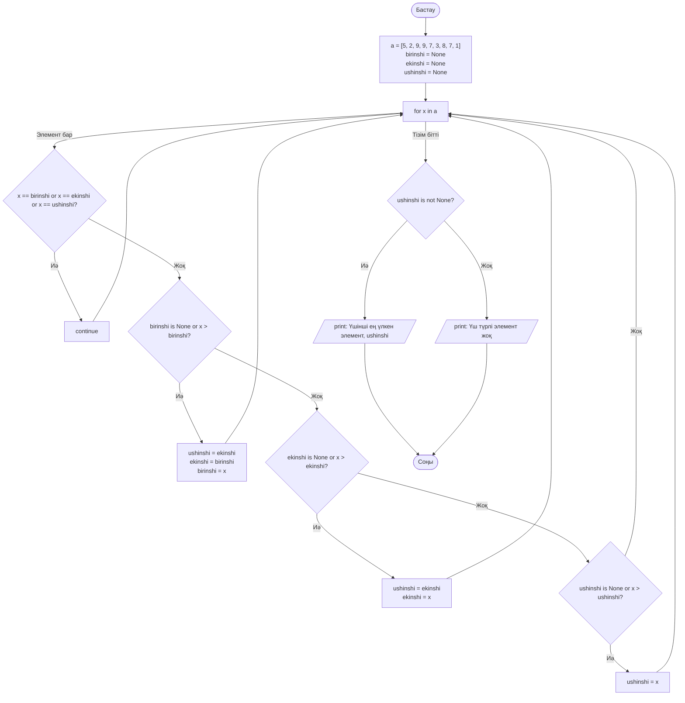

graph TD
    Start2([Бастау]) --> Input["text = input(...)"]
    Input --> Split["words = text.split()"]
    Split --> Init2["best_word = ''   best_count = 0"]
    
    Init2 --> Loop2["for word in words"]
    
    Loop2 -- "Сөз бар" --> InitDiff["different = ''"]
    InitDiff --> LoopSym["for symbol in word"]
    
    LoopSym -- "Символ бар" --> CheckSym{"symbol not in different?"}
    CheckSym -- "Иә" --> AddSym["different += symbol"] --> LoopSym
    CheckSym -- "Жоқ" --> LoopSym
    
    LoopSym -- "Символ бітті" --> Calc["count = len(different)"]
    
    Calc --> CheckCount{"count > best_count?"}
    CheckCount -- "Иә" --> Upd1["best_count = count   best_word = word"] --> Loop2
    CheckCount -- "Жоқ" --> CheckLen{"count == best_count and len(word) > len(best_word)?"}
    
    CheckLen -- "Иә" --> Upd2["best_word = word"] --> Loop2
    CheckLen -- "Жоқ" --> Loop2
    
    Loop2 -- "Сөз бітті" --> Print2[/print: Әртүрлі символдары ең көп сөз және саны/]
    Print2 --> End2([Соңы])

    graph TD
    Start3([Бастау]) --> Input3["N мен M енгізу және A матрицасын жасау"]
    
    Input3 --> Transpose["AT = матрицаны транспонирлеу"]
    
    Transpose --> PrintA["Бастапқы матрицаны шығару"]
    PrintA --> PrintAT["Транспонирленген матрицаны шығару"]
    
    PrintAT --> CheckM{"M < N?"}
    CheckM -- "Иә" --> Set1["diagonal_count = M"] --> DiagLoop
    CheckM -- "Жоқ" --> Set2["diagonal_count = N"] --> DiagLoop
    
    DiagLoop["for i in range(diagonal_count)"] -- "Элемент бар" --> CheckEq{"A[i][i] == AT[i][i]?"}
    
    CheckEq -- "Иә" --> PrintEq[/print: тең/] --> DiagLoop
    CheckEq -- "Жоқ" --> PrintNotEq[/print: тең емес/] --> DiagLoop
    
    DiagLoop -- "Аяқталды" --> End3([Соңы])
