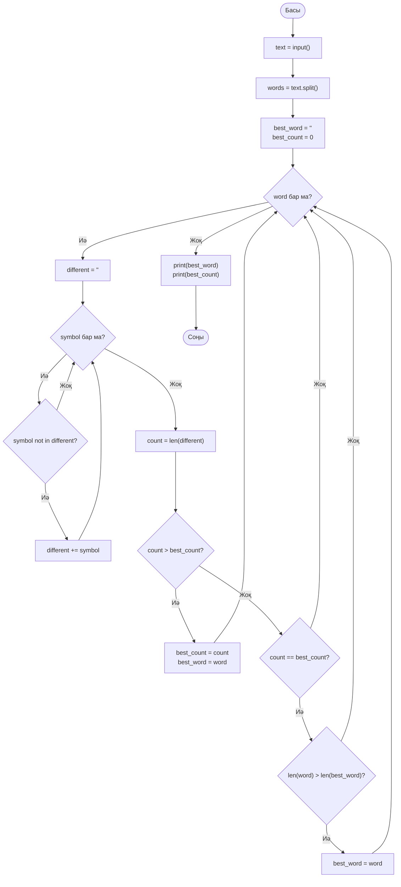
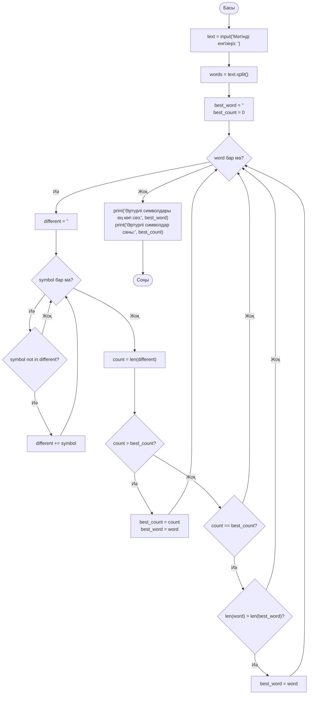
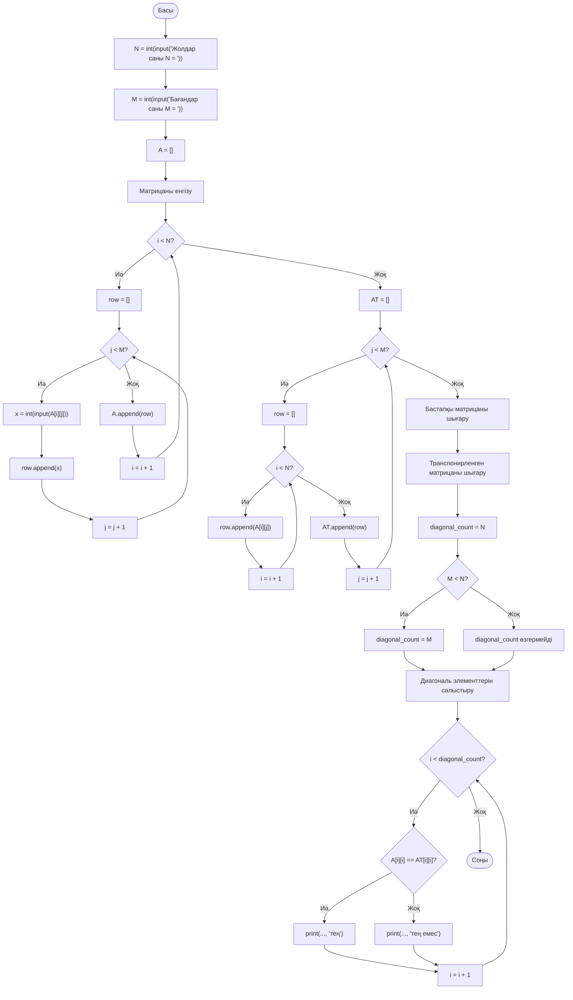

```mermaid
flowchart TD
    A([Басы]) --> B["text = input()"]
    B --> C["words = text.split()"]
    C --> D["best_word = ''<br/>best_count = 0"]
    D --> E{"word бар ма?"}

    E -->|Иә| F["different = ''"]
    F --> G{"symbol бар ма?"}

    G -->|Иә| H{"symbol not in different?"}
    H -->|Иә| I["different += symbol"]
    H -->|Жоқ| G
    I --> G

    G -->|Жоқ| J["count = len(different)"]
    J --> K{"count > best_count?"}

    K -->|Иә| L["best_count = count<br/>best_word = word"]
    K -->|Жоқ| M{"count == best_count?"}

    M -->|Иә| N{"len(word) > len(best_word)?"}
    M -->|Жоқ| E

    N -->|Иә| O["best_word = word"]
    N -->|Жоқ| E
    O --> E
    L --> E

    E -->|Жоқ| P["print(best_word)<br/>print(best_count)"]
    P --> Q([Соңы])
```

```mermaid
flowchart TD
    A([Басы]) --> B["text = input('Мәтінді енгізіңіз: ')"]
    B --> C["words = text.split()"]
    C --> D["best_word = ''<br/>best_count = 0"]
    D --> E{"word бар ма?"}

    E -->|Иә| F["different = ''"]
    F --> G{"symbol бар ма?"}
    G -->|Иә| H{"symbol not in different?"}

    H -->|Иә| I["different += symbol"]
    H -->|Жоқ| G
    I --> G

    G -->|Жоқ| J["count = len(different)"]
    J --> K{"count > best_count?"}

    K -->|Иә| L["best_count = count<br/>best_word = word"]
    K -->|Жоқ| M{"count == best_count?"}

    M -->|Иә| N{"len(word) > len(best_word)?"}
    M -->|Жоқ| E

    N -->|Иә| O["best_word = word"]
    N -->|Жоқ| E
    O --> E
    L --> E

    E -->|Жоқ| P["print('Әртүрлі символдары ең көп сөз:', best_word)<br/>print('Әртүрлі символдар саны:', best_count)"]
    P --> Q([Соңы])
```

```mermaid
flowchart TD
    A([Басы]) --> B["N = int(input('Жолдар саны N = '))"]
    B --> C["M = int(input('Бағандар саны M = '))"]
    C --> D["A = []"]
    D --> E["Матрицаны енгізу"]

    E --> F{"i < N?"}
    F -->|Иә| G["row = []"]
    G --> H{"j < M?"}
    H -->|Иә| I["x = int(input(A[i][j]))"]
    I --> J["row.append(x)"]
    J --> K["j = j + 1"]
    K --> H
    H -->|Жоқ| L["A.append(row)"]
    L --> M["i = i + 1"]
    M --> F

    F -->|Жоқ| N["AT = []"]
    N --> O{"j < M?"}
    O -->|Иә| P["row = []"]
    P --> Q{"i < N?"}
    Q -->|Иә| R["row.append(A[i][j])"]
    R --> S["i = i + 1"]
    S --> Q
    Q -->|Жоқ| T["AT.append(row)"]
    T --> U["j = j + 1"]
    U --> O

    O -->|Жоқ| V["Бастапқы матрицаны шығару"]
    V --> W["Транспонирленген матрицаны шығару"]

    W --> X["diagonal_count = N"]
    X --> Y{"M < N?"}
    Y -->|Иә| Z["diagonal_count = M"]
    Y -->|Жоқ| AA["diagonal_count өзгермейді"]
    Z --> AB["Диагональ элементтерін салыстыру"]
    AA --> AB

    AB --> AC{"i < diagonal_count?"}
    AC -->|Иә| AD{"A[i][i] == AT[i][i]?"}
    AD -->|Иә| AE["print(..., 'тең')"]
    AD -->|Жоқ| AF["print(..., 'тең емес')"]
    AE --> AG["i = i + 1"]
    AF --> AG
    AG --> AC

    AC -->|Жоқ| AH([Соңы])
```
