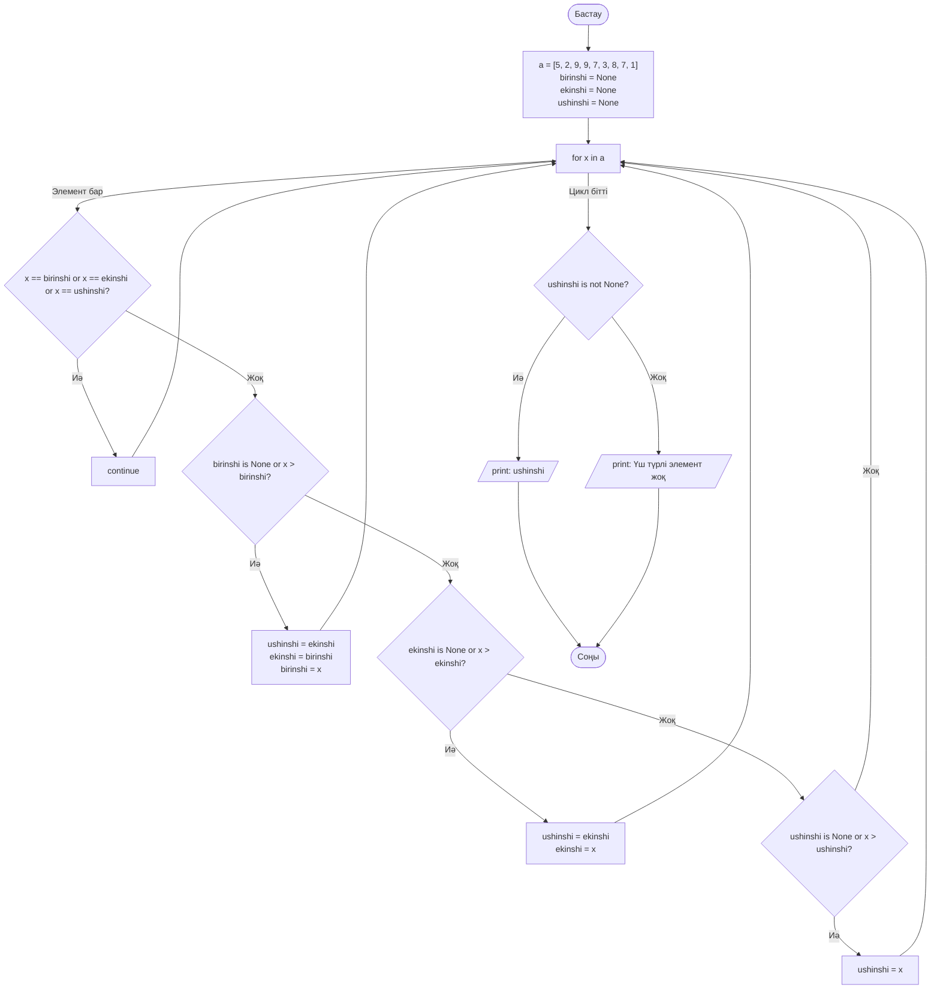
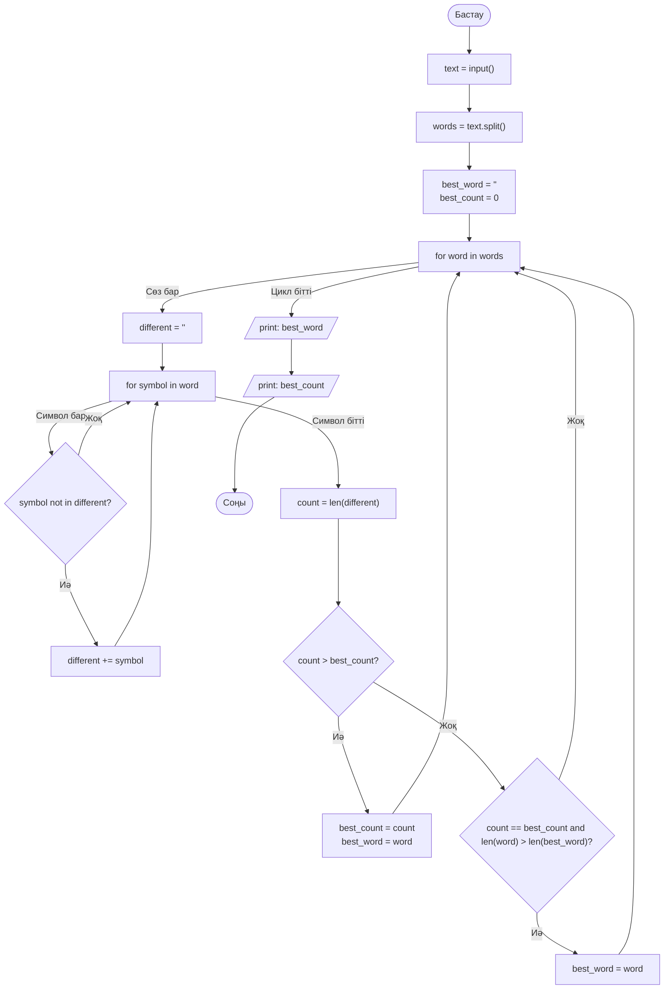
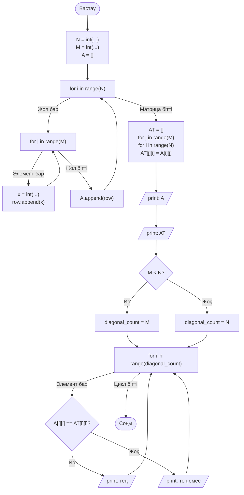

```mermaid
graph TD
    Start([Бастау]) --> Init["a = [5, 2, 9, 9, 7, 3, 8, 7, 1] <br/> birinshi = None <br/> ekinshi = None <br/> ushinshi = None"]
    
    Init --> Loop["for x in a"]
    
    Loop -- "Элемент бар" --> CheckDup{"x == birinshi or x == ekinshi or x == ushinshi?"}
    
    CheckDup -- "Иә" --> Continue["continue"] --> Loop
    CheckDup -- "Жоқ" --> Check1{"birinshi is None or x > birinshi?"}
    
    Check1 -- "Иә" --> Up1["ushinshi = ekinshi <br/> ekinshi = birinshi <br/> birinshi = x"] --> Loop
    Check1 -- "Жоқ" --> Check2{"ekinshi is None or x > ekinshi?"}
    
    Check2 -- "Иә" --> Up2["ushinshi = ekinshi <br/> ekinshi = x"] --> Loop
    Check2 -- "Жоқ" --> Check3{"ushinshi is None or x > ushinshi?"}
    
    Check3 -- "Иә" --> Up3["ushinshi = x"] --> Loop
    Check3 -- "Жоқ" --> Loop
    
    Loop -- "Цикл бітті" --> CheckFinal{"ushinshi is not None?"}
    
    CheckFinal -- "Иә" --> PrintYes[/print: ushinshi/]
    CheckFinal -- "Жоқ" --> PrintNo[/print: Үш түрлі элемент жоқ/]
    
    PrintYes --> End([Соңы])
    PrintNo --> End([Соңы])
```

```mermaid
graph TD
    Start([Бастау]) --> Input["text = input()"]
    
    Input --> Split["words = text.split()"]
    Split --> Init["best_word = '' <br/> best_count = 0"]
    
    Init --> LoopWord["for word in words"]
    
    LoopWord -- "Сөз бар" --> InitDiff["different = ''"]
    InitDiff --> LoopSym["for symbol in word"]
    
    LoopSym -- "Символ бар" --> CheckSym{"symbol not in different?"}
    
    CheckSym -- "Иә" --> AddSym["different += symbol"] --> LoopSym
    CheckSym -- "Жоқ" --> LoopSym
    
    LoopSym -- "Символ бітті" --> Calc["count = len(different)"]
    
    Calc --> CheckCount{"count > best_count?"}
    
    CheckCount -- "Иә" --> Upd1["best_count = count <br/> best_word = word"] --> LoopWord
    CheckCount -- "Жоқ" --> CheckLen{"count == best_count and len(word) > len(best_word)?"}
    
    CheckLen -- "Иә" --> Upd2["best_word = word"] --> LoopWord
    CheckLen -- "Жоқ" --> LoopWord
    
    LoopWord -- "Цикл бітті" --> Print1[/print: best_word/]
    
    Print1 --> Print2[/print: best_count/]
    
    Print2 --> End([Соңы])
```

```mermaid
   graph TD
    Start([Бастау]) --> Input["N = int(...) <br/> M = int(...) <br/> A = []"]
    
    Input --> LoopN["for i in range(N)"]
    LoopN -- "Жол бар" --> LoopM["for j in range(M)"]
    LoopM -- "Элемент бар" --> ReadX["x = int(...) <br/> row.append(x)"] --> LoopM
    
    LoopM -- "Жол бітті" --> AppA["A.append(row)"] --> LoopN
    
    LoopN -- "Матрица бітті" --> Trans["AT = [] <br/> for j in range(M) <br/> for i in range(N) <br/> AT[j][i] = A[i][j]"]
    
    Trans --> PrintA[/print: A/]
    PrintA --> PrintAT[/print: AT/]
    
    PrintAT --> CheckM{"M < N?"}
    CheckM -- "Иә" --> SetM["diagonal_count = M"] --> DiagLoop
    CheckM -- "Жоқ" --> SetN["diagonal_count = N"] --> DiagLoop
    
    DiagLoop["for i in range(diagonal_count)"] -- "Элемент бар" --> CheckEq{"A[i][i] == AT[i][i]?"}
    
    CheckEq -- "Иә" --> PrintEq[/print: тең/] --> DiagLoop
    CheckEq -- "Жоқ" --> PrintNotEq[/print: тең емес/] --> DiagLoop
    
    DiagLoop -- "Цикл бітті" --> End([Соңы])
```
